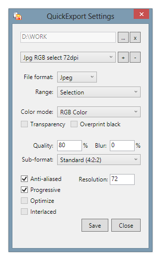
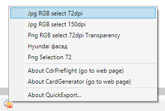

# QuickExport

Easy 2-click export to jpeg or png. Supports export as selections as all pages. 
Files are saved in the folder of the document, or in 'My Documents' folder if the document isn't yet saved, or custom folder.

#### Usage

Left click opens Settings window where you can manage your presets.
Right click on macro's icon opens context menu where you can run your presets.

## Tech Specs

* Compatibility: CorelDRAW X6+;
* Localisation: EnglishUS;
* [How to build and install](https://github.com/cdrpro-macros/build-and-Install-csharp-macros).

## License

Copyright © 2016 [Sancho](http://cdrpro.ru/en/)

This program is free software: you can redistribute it and/or modify
it under the terms of the GNU General Public License as published by
the Free Software Foundation, either version 3 of the License, or
(at your option) any later version.

This program is distributed in the hope that it will be useful,
but WITHOUT ANY WARRANTY; without even the implied warranty of
MERCHANTABILITY or FITNESS FOR A PARTICULAR PURPOSE.  See the
GNU General Public License for more details.

You should have received a copy of the GNU General Public License
along with this program.  If not, see http://www.gnu.org/licenses/.